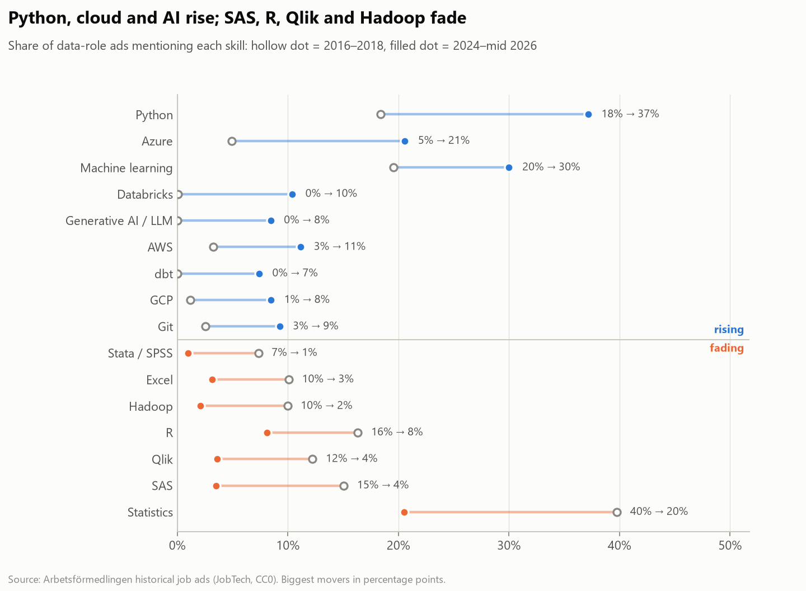
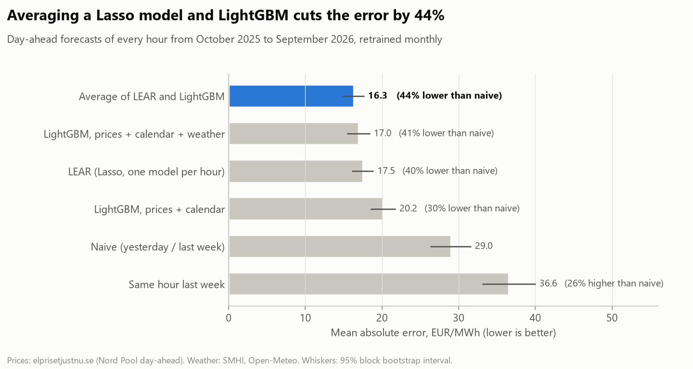
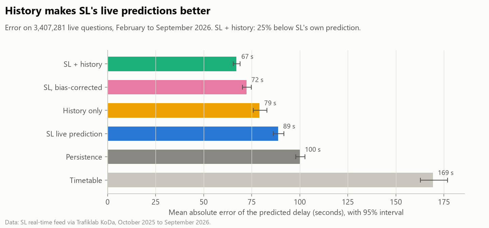

::: {.hero}
{.avatar fig-alt="Profile illustration: black suit with a red tie"}

::: {.hero-text}
# Raghunandan Rajkumar

[Data Scientist · Data Analyst · Stockholm]{.role}

::: {.pitch}
Physicist turned data scientist. I take messy, real-world data and get clear and meaningful answers to important questions.  
Check out the Projects section to see my work.

I work in Python and SQL, build models with scikit-learn and PyTorch, and report in Power BI and
Streamlit.  
MSc in AI for Health from Stockholm University (2026).  
English (C1) and Swedish (B1/B2).
:::

:::

[<i class="bi bi-chevron-down"></i>](#projects){.scroll-cue aria-label="Scroll to projects"}
:::

## Projects {#projects .section-title}

::: {.cards}

::: {.card-project}
{fig-alt="Biggest risers and fallers among skills in Swedish data job ads"}

[Finished]{.status .done}

### What do Swedish employers ask data people for?

Ten years of Arbetsförmedlingen job ads (7.7 million scanned, 16,067 data jobs analysed). Python, cloud
platforms and generative AI have replaced the old statistics toolkit; SQL stays the constant.

::: {.tags}
[Python]{.tag} [DuckDB / SQL]{.tag} [Power BI]{.tag} [Streamlit]{.tag} [NLP]{.tag}
:::

::: {.card-links}
[Code on GitHub →](https://github.com/rose-ember-forge/Skill-Trends-in-Data-Jobs-in-Sweden)
:::
:::

::: {.card-project}
{fig-alt="Model comparison: averaging LEAR and LightGBM cuts the forecast error by 44% against the naive benchmark"}

[Finished]{.status .done}

### Forecasting tomorrow's electricity price in Stockholm

Hourly day-ahead price forecasts for SE3, back-tested on a full year using only what was known before the
noon auction. Averaging a Lasso model (LEAR) and LightGBM with weather forecasts cuts the error by 44%
against the standard benchmark. A daily GitHub Action makes and scores a live forecast.

::: {.tags}
[Python]{.tag} [LightGBM]{.tag} [Lasso]{.tag} [Time series]{.tag} [Conformal intervals]{.tag} [DuckDB / SQL]{.tag} [Streamlit]{.tag}
:::

::: {.card-links}
[Code on GitHub →](https://github.com/rose-ember-forge/Forecasting-Electricity-Prices-in-Stockholm)
:::
:::

::: {.card-project}
{fig-alt="Model comparison: SL plus history has a mean error of 67 seconds against 89 seconds for SL's own live prediction"}

[Finished]{.status .done}

### Why is my SL bus late?

A year of Stockholm public transport (168 million departures) rebuilt from SL's archived real-time feed:
two in three buses run on time against 96% of metro departures, and snow costs buses 6 points per 10 cm.
A LightGBM model makes SL's own live delay predictions 25% more accurate.

::: {.tags}
[Python]{.tag} [DuckDB / SQL]{.tag} [GTFS-Realtime]{.tag} [LightGBM]{.tag} [Geospatial]{.tag} [Statistical testing]{.tag} [Streamlit]{.tag}
:::

::: {.card-links}
[Code on GitHub →](https://github.com/rose-ember-forge/SL-Delays)
:::
:::

::: {.card-project}
[In progress]{.status .wip}

### Project 4

Details coming soon.

::: {.tags}
[In progress]{.tag}
:::
:::

:::

## Earlier work {.section-title}

::: {.earlier}
- **Physics-informed neural network for Greenland Ice Sheet melt** (Master's thesis, two-person team)<br>
  [PyTorch model enforcing surface energy balance constraints through the loss function.]{.meta}
- **EEG-based human emotion recognition** (published paper, research team)<br>
  [Entropy measures as features for classifying emotions from EEG signals. [Read the paper](https://doi.org/10.1186/s40708-021-00141-5)]{.meta}
- **Hex Colour Cube**<br>
  [Interactive WebGL view of 4,096 hex colours in RGB space. [Web page](https://rose-ember-forge.github.io/HEX-cube/)]{.meta}
- **Book recommendation web app** (team project)<br>
  [Flask app with TF-IDF sentiment analysis and genre prediction from book summaries.]{.meta}
- **SpaceX launch analysis** (IBM Data Science capstone)<br>
  [Data from a REST API and web scraping, SQL and Folium/Plotly EDA, four classifiers compared.]{.meta}
:::

## About {#about .section-title .narrow}

I'm looking for **Data Scientist** and
**Data Analyst** roles in Stockholm and elsewhere in Sweden.

My background is research: three years modelling biological neural networks with deep learning, a
published paper on emotion recognition from EEG, and a master's thesis on physics-informed neural networks
for the Greenland Ice Sheet. Now I use the same rigour on business-shaped questions: clean the data,
check the edge cases, and explain the result so people can act on it.

[Download CV (PDF)](files/Raghunandan_Rajkumar_CV.pdf){.btn-red download="Raghunandan_Rajkumar_CV.pdf"}

## Experience {.section-title .narrow}

::: {.timeline}
- **Research Scholar**, Department of Physics, Pondicherry University<br>
  [Jul 2018 – Nov 2021 · Pondicherry, India]{.when}<br>
  Led a three-year project using artificial and deep neural networks to model biological neural networks.
  Analysed EEG datasets with entropy measures to recognise human emotions
  ([published paper](https://doi.org/10.1186/s40708-021-00141-5)).
- **Workshop Organiser**, Pondicherry University<br>
  [2019 · Pondicherry, India]{.when}<br>
  Designed and ran a LaTeX workshop for physics students, which led to department-wide adoption.
- **Teacher**, Yuvaraja's College<br>
  [2017 · Mysuru, India]{.when}<br>
  Taught master's-level physics and C programming and mentored students through problem solving.
:::

## Education {.section-title .narrow}

::: {.timeline}
- **MSc in AI for Health**, Stockholm University<br>
  [2024 – 2026 · Stockholm, Sweden]{.when}
- **MSc in Physics**, Yuvaraja's College, University of Mysore<br>
  [2016 – 2018 · Mysuru, India]{.when}
- **BSc in Physics, Chemistry and Mathematics**, Yuvaraja's College, University of Mysore<br>
  [2013 – 2016 · Mysuru, India]{.when}
:::

## Skills {.section-title .narrow}

- **Languages:** Python, SQL, R, LaTeX, C
- **Data science:** machine learning, deep learning, data visualisation, NLP, sentiment analysis
- **Tools:** pandas, scikit-learn, LightGBM, PyTorch, DuckDB, Power BI, Streamlit, Plotly, Folium, Git

## Certifications {.section-title .narrow}

- Data Science for Engineers · NPTEL, IIT Madras (2022)
- Data Science Professional Certificate · IBM via Coursera (2022)
- Machine Learning · Stanford Online via Coursera (2021)
- IELTS Academic · overall band 8.0, CEFR C1 (2022)

## Languages {.section-title .narrow}

English (C1) · Swedish (B1/B2) · Kannada · Malayalam · Hindi

## Contact {#contact .section-title .contact-footer}

I'm open to Data Scientist and Data Analyst roles in Stockholm and across Sweden.
The fastest way to reach me is email.

```{=html}
<ul class="contact-list">
  <li><i class="bi bi-envelope-fill"></i>
    <div><span class="label">Email</span>
      <a href="mailto:raghunandan.officialuse@gmail.com">raghunandan.officialuse@gmail.com</a></div></li>
  <li><i class="bi bi-linkedin"></i>
    <div><span class="label">LinkedIn</span>
      <a href="https://www.linkedin.com/in/raghunandan-rajkumar">linkedin.com/in/raghunandan-rajkumar</a></div></li>
  <li><i class="bi bi-github"></i>
    <div><span class="label">GitHub</span>
      <a href="https://github.com/rose-ember-forge">github.com/rose-ember-forge</a></div></li>
  <li><i class="bi bi-geo-alt-fill"></i>
    <div><span class="label">Location</span>Stockholm, Sweden</div></li>
</ul>
```
